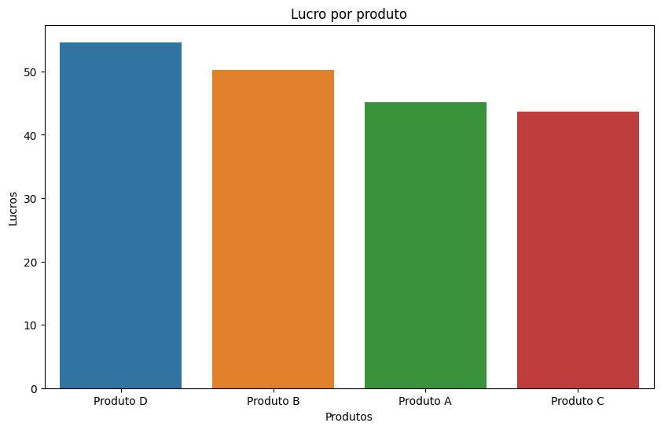
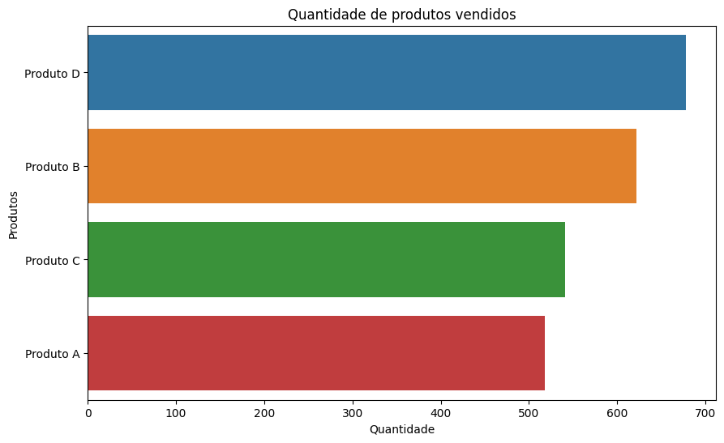
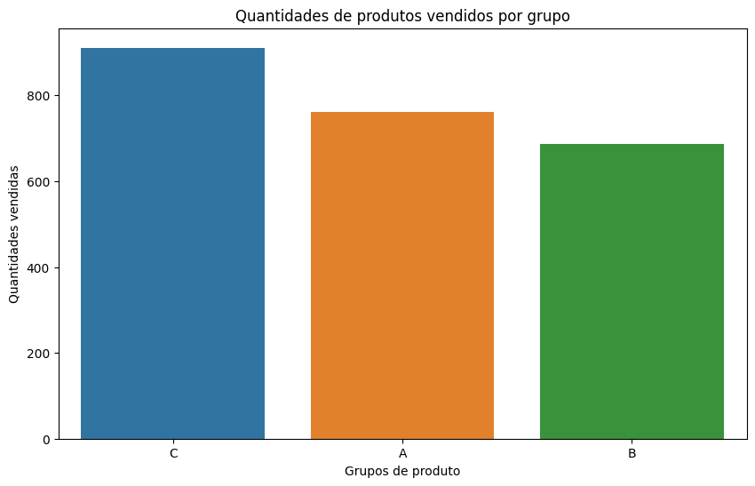
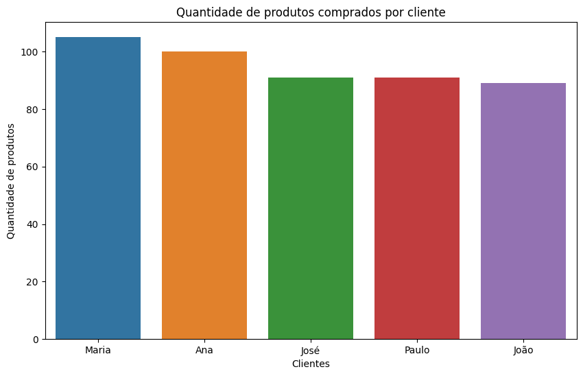
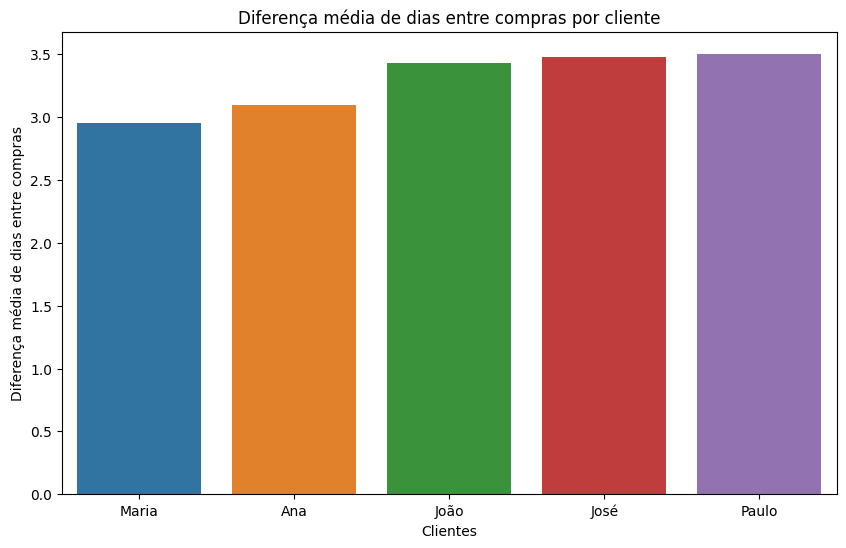

# Extraindo dados de um arquivo pdf para análise de vendas

## Introdução

Uma plataforma de e-commerce de moda necessita extrair dados de um arquivo pdf para investigar as métricas-chave relacionadas aos produtos da empresa.

## Objetivo do projeto

Desenvolver as seguintes métricas:

* Lucro por produto;
* Produto mais lucrativo;
* Produtos mais e menos vendidos;
* 5 primeiros clientes que mais compram;
* Frequência de compra por cliente.

## Deployment

Para executar o código deste projeto é necessário instalar as seguintes bibliotecas:
* tabula
* numpy
* pandas
* seaborn
* matplotlib
* sklearn

Feitas estas instalações, basta baixar o arquivo do dataset e o arquivo do código .ipynb e executá-lo em um interpretador de códigos jupyter notebook (Visual Studio Code por exemplo ou outro semelhante).

## Resultados

### Lucro por produto

### Produto mais lucrativo

<table border="1" class="dataframe">
  <thead>
    <tr style="text-align: right;">
      <th></th>
      <th>product</th>
      <th>profit</th>
    </tr>
  </thead>
  <tbody>
    <tr>
      <th>0</th>
      <td>Produto D</td>
      <td>54.61</td>
    </tr>
  </tbody>
</table>

### Produtos mais e menos vendidos

<table border="1" class="dataframe">
  <thead>
    <tr style="text-align: right;">
      <th></th>
      <th>product</th>
      <th>quantity</th>
    </tr>
  </thead>
  <tbody>
    <tr>
      <th>0</th>
      <td>Produto D</td>
      <td>678</td>
    </tr>
    <tr>
      <th>1</th>
      <td>Produto B</td>
      <td>622</td>
    </tr>
    <tr>
      <th>2</th>
      <td>Produto C</td>
      <td>541</td>
    </tr>
    <tr>
      <th>3</th>
      <td>Produto A</td>
      <td>518</td>
    </tr>
  </tbody>
</table>

### 5 primeiros clientes que mais compram

<table border="1" class="dataframe">
  <thead>
    <tr style="text-align: right;">
      <th></th>
      <th>cliente</th>
      <th>quantidade_comprada</th>
    </tr>
  </thead>
  <tbody>
    <tr>
      <th>0</th>
      <td>Maria</td>
      <td>105</td>
    </tr>
    <tr>
      <th>1</th>
      <td>Ana</td>
      <td>100</td>
    </tr>
    <tr>
      <th>2</th>
      <td>José</td>
      <td>91</td>
    </tr>
    <tr>
      <th>3</th>
      <td>Paulo</td>
      <td>91</td>
    </tr>
    <tr>
      <th>4</th>
      <td>João</td>
      <td>89</td>
    </tr>
  </tbody>
</table>

### Frequência de compra por cliente

<table border="1" class="dataframe">
  <thead>
    <tr style="text-align: right;">
      <th></th>
      <th>frequencia_compra</th>
      <th>lucro_total</th>
      <th>quantidade_produtos_comprados</th>
      <th>ticket_medio</th>
    </tr>
    <tr>
      <th>customer</th>
      <th></th>
      <th></th>
      <th></th>
      <th></th>
    </tr>
  </thead>
  <tbody>
    <tr>
      <th>Maria</th>
      <td>2.951923</td>
      <td>6101.61</td>
      <td>567</td>
      <td>282.94</td>
    </tr>
    <tr>
      <th>Ana</th>
      <td>3.101010</td>
      <td>4946.88</td>
      <td>485</td>
      <td>252.35</td>
    </tr>
    <tr>
      <th>João</th>
      <td>3.431818</td>
      <td>4056.27</td>
      <td>450</td>
      <td>237.05</td>
    </tr>
    <tr>
      <th>José</th>
      <td>3.477778</td>
      <td>4122.09</td>
      <td>430</td>
      <td>222.83</td>
    </tr>
    <tr>
      <th>Paulo</th>
      <td>3.500000</td>
      <td>4024.78</td>
      <td>427</td>
      <td>222.45</td>
    </tr>
  </tbody>
</table>

